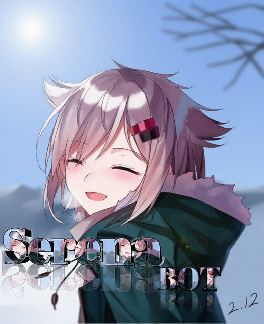

<p align="center">
> <a href="https://youtu.be/ko8d0w_qtWA">
<a href="https://youtube.com/channel/UCLuR4JkvjkqQT8NebAHqW0Q">
</p>

## Serena

> <a href="https://youtube.com/channel/UCLuR4JkvjkqQT8NebAHqW0Q"><br>

> [Automated Multi Device whatsapp bot created](Serena) by [sahilteamx 🥵](github.com/sahilteamx)

> Dont forget to give a star bro.🥲 IF Heroku Deploy seems Error, Fork This Repo And Try Deploy Again

> If The Api Of This Bot Run Empty You Can Change it To Your Own Api By Changing [Here](https://github.com/sahilteamx/Serena/blob/master/settings.js#L18) And Register [here](https://zenzapis.xyz/) to get apikey


</br>

<a href="https://github.com/sahilteamx/Serena"></a>  
<a href="https://github.com/sahilteamx/Serena"></a>
<a href="https://github.com/sahilteamx/Serena/network/members"></a>
<a href="https://github.com/sahilteamx/Serena/watchers"></a> <br>

---

<!-- Requirements -->
<b><details><summary>Requirements</summary></b>
* Some Text Editor
* [Node JS](https://nodejs.org/en/)
* [Git](https://git-scm.com/downloads)
* [FFMPEG](https://ffmpeg.org/download.html)
  
```bash
Add FFmpeg to PATH environment variable
```
</details>


<!-- Start via Heroku -->
<b><details><summary>Start via Heroku</summary></b>

* Scan QR In Your Whatsapp From [Here](https://replit.com/@LOSTHACKEROFC/Md-Scanner?outputonly=1&lite=1)
* Fork This Repo By Clicking [Here](https://github.com/sahilteamx/Serena/fork)
* then Deploy The Bot From [Here](https://heroku.com/deploy)
* Wait 5-10 Min To Deploy 
* After Deploying On The Worker And Check The Logs

</details>


<!-- Installation via Termux -->
<b><details><summary>Installation on Termux</summary></b>
```bash
> apt update
> apt upgrade
> pkg update && pkg upgrade
> pkg install bash
> pkg install libwebp
> pkg install git -y
> pkg install nodejs -y 
> pkg install ffmpeg -y 
> pkg install wget
> pkg install imagemagick -y
> git clone https://github.com/sahilteamx/Serena
> cd Serena
> npm install
```
</details>

<!-- Edit -->
<b><details><summary>Edit settings.js</summary></b>
```bash
global.APIKeys = {
	'https://zenzapis.xyz': 'YOURAPIKEY',
}
  
global.owner = ["919536476115"]
global.ownername = ["sahilteamx 👨🏻‍💻"]
```
</details>


<!-- 24hrs-->
<b><details><summary>For 24 Hours Activation</summary></b>

```bash
npm i -g pm2 && pm2 start index.js && pm2 save && pm2 logs
```

</details>

----


<b><details><summary>Available Features</summary><br>
	
| Features |  Availability |
| :------: |  :----------: |
|   Convert     |       ✅     |
|   Database     |       ✅     |
|   Owner     |       ✅    |
|   Islami     |       ✅     |
|   Downloader     |       ✅     |
|   Webzone     |       ✅[      |
|   Searching     |       ✅      |
|   Textpro     |       ✅      |
|   Ephoto     |       ✅     |
|   Primbon     |       ✅     |
|   Anime Web     |       ✅      |
|   Stalker     |       ✅      |
|   Random Text     |       ✅     |
|   Random Image     |       ✅     |
|   Nekos Life     |       ✅      |
|   More Nsfw     |       ✅      |
|   Creator     |       ✅      |

</details>


----

<!-- Contact Owner -->
<b><details><summary>Contact</summary></b>

## ```Connect With Me```
<p align="center">
<a href="https://wa.me/918601600591">
<a href="https://youtube.com/channel/UCLuR4JkvjkqQT8NebAHqW0Q"><br>
</p>

</details>


</details><hr>

## Thanks To
* [`@adiwajshing/baileys`](https://github.com/adiwajshing/baileys)
* [`Alien-Alfa`](https://github.com/Alien-Alfa)
* [`DGXeon`](https://github.com/DGXeon)
* [`AflahXrd`](https://github.com/nexusNw)
* [`sahilteamx`](https://github.com/sahilteamx/Serena)

License: [MIT](https://github.com/sahilteamx/Serena/LICENSE)
